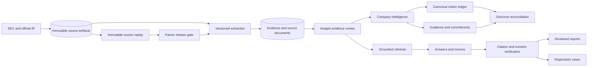

# Architecture Guide

This directory is the reviewer-oriented map of the terminal. It explains the boundaries and decisions that are difficult to infer from screenshots or route counts.

## Runtime Flow

## Bounded Contexts

| Context | Owns | Entry points |
| --- | --- | --- |
| Evidence | Source normalization, passages, quality, analyst acceptance | `lib/sec`, `lib/ir`, `lib/research/evidence.ts` |
| Source artifacts | Content-addressed storage, document versions, parser replay | `lib/artifacts` |
| Company intelligence | Fiscal periods, metrics, comparisons, commitments | `lib/company-intelligence` |
| Research generation | Retrieval, answers, memos, verification | `lib/research` |
| Evaluation | Curated benchmarks and production regressions | `lib/research/quality*` |
| Extraction quality | Immutable source contracts, replay scoring, parser releases | `lib/extraction-quality` |
| Collaboration | Workspaces, roles, reviews, publishing | `lib/auth`, `lib/reviews`, `lib/reports` |
| Operations | Durable jobs, retries, tracing, briefings | `lib/operations` |

## Reviewer Path

1. Start with `app/terminal-navigation.ts` for the product information architecture and URL contract.
2. Read `lib/artifacts/policy.ts` and ADR-004 for the raw-to-derived data boundary.
3. Read `lib/company-intelligence/commitments/policy.ts` for deterministic domain rules.
4. Inspect the authenticated API routes for authorization boundaries.
5. Inspect the deterministic tests and Playwright analyst journey for executable proof.
6. Run `pnpm research:extraction-quality -- --gate` to replay the real local source corpus.

## Decision Records

- [ADR-001: Stable commitment identity](adr-001-commitment-identity.md)
- [ADR-002: Append-only temporal revisions](adr-002-append-only-revisions.md)
- [ADR-003: Human-reviewed reconciliation](adr-003-human-reviewed-reconciliation.md)
- [ADR-004: Immutable source artifacts and versioned extraction](adr-004-immutable-source-artifacts.md)
- [ADR-005: Real-document parser release gates](adr-005-real-document-parser-gates.md)

The legacy Drizzle schema remains a central table registry. New bounded contexts can own a separate schema module and merge it in `lib/db/client.ts`; artifact and extraction-quality tables follow that pattern. Domain behavior does not live in schema files.
