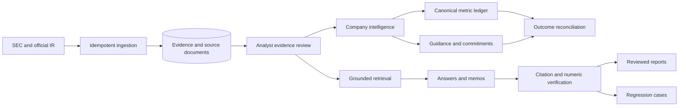

# Architecture Guide

This directory is the reviewer-oriented map of the terminal. It explains the boundaries and decisions that are difficult to infer from screenshots or route counts.

## Runtime Flow

## Bounded Contexts

| Context | Owns | Entry points |
| --- | --- | --- |
| Evidence | Source normalization, passages, quality, analyst acceptance | `lib/sec`, `lib/ir`, `lib/research/evidence.ts` |
| Company intelligence | Fiscal periods, metrics, comparisons, commitments | `lib/company-intelligence` |
| Research generation | Retrieval, answers, memos, verification | `lib/research` |
| Evaluation | Curated benchmarks and production regressions | `lib/research/quality*` |
| Collaboration | Workspaces, roles, reviews, publishing | `lib/auth`, `lib/reviews`, `lib/reports` |
| Operations | Durable jobs, retries, tracing, briefings | `lib/operations` |

## Reviewer Path

1. Start with `app/terminal-navigation.ts` for the product information architecture and URL contract.
2. Read `lib/company-intelligence/commitments/policy.ts` for deterministic domain rules.
3. Read `lib/company-intelligence/commitments/service.ts` for persistence, review, valid-time selection, and reconciliation.
4. Inspect `app/api/commitments/route.ts` for authorization boundaries.
5. Inspect `tests/commitments-ledger.test.ts` and the Playwright analyst journey for executable proof.

## Decision Records

- [ADR-001: Stable commitment identity](adr-001-commitment-identity.md)
- [ADR-002: Append-only temporal revisions](adr-002-append-only-revisions.md)
- [ADR-003: Human-reviewed reconciliation](adr-003-human-reviewed-reconciliation.md)

The Drizzle schema remains a central table registry so foreign-key relationships are visible in one place. Domain behavior does not live there; it is organized under the bounded contexts above.
